_You are reading the history of my layout's creation. For the zmk code, click [here](https://github.com/croxtonveryepic/glove80-zmk-config)_.

# Lock In: Rethinking the Human-Computer Interface

Before getting into the details of motivation, I want to answer this question: was it worth is? When I was first flirting with the idea of an alternate keyboard layout, I heard a lot of mixed opinions on the topic. The balance was leaning a bit to the "I wouldn't do it again" side.

I have zero regrets. But, I think I did it for the right reasons. I never learned to type correctly on QWERTY. For me, the keyboard was a game controller first and a symbol input device second. Any new layout that addressed some of QWERTY's shortcomings would offer some concrete practical advantages, but for me, simply being forced to learn from scratch would give me the opportunity to truly touch-type, unburdened from bad habits made on QWERTY.

Creating this layout was explore a topic that was fun and interesting to me at the time, practicing it was learning for the sake of learning, the new modifier key locations opened new possibilities for shortcuts, and the "mouse layer" let me fundamentally change how I interact with the computer. **I don't think you should ever force yourself to learn a tool just to be more productive.** If you don't find the learning process fun and meaningful, stick to what you know, or otherwise work on your biology or mindset until you are having fun.

I think an "ideal" keyboard layout and toolset minimizes "input friction"—the time and mental energy spent translating intention to physical inputs and digital actions. Practicing any layout or toolset will lower input friction over time, but if they are fundamentally underpowered or biologically incoherent (discussed later), you will get stuck at a local maximum.

The issue of high input friction is not just a matter of speed. One of the fundamental actions of serotonin is to reduce coherence in the nervous system, i.e., sections gets compartmentalized and acts independently. A person with too much serotonin tends to stumble over their words, because it takes conscious effort to keep the verbal center in sync with the muscles in the mouth, tongue, and throat. In the same way, any conscious thought you give to your keyboard is robbing you of mental energy that could have been spent on the task at hand. Moreover, conforming to an incoherent toolset is biological stress in and of itself, contributing to rigidification of thought. So why do we use a keyboard and mouse, a combination designed for people with a third arm coming out of their chest?

To reiterate: this is about fun and coherence, not speed. But if you are interested in speed, here's a thought experiment. Say it takes you 2 months to learn a new layout, during which you are 0% of your current productivity. At the end of the two months, you are 1% more productive than before. Using these extremely cautious numbers, it would take you 200 months to make up the initial time investment—17 years. So unless you plan on retiring in that time (and never using a computer again), it's worth it. It's better in reality because your productivity scales up during the initial months and the gains are probably at least 5%.

### The Mouse Problems

When you sit down at a computer for the first time, you are presented with two input devices: the mouse and the keyboard. The former is simple enough: a pointer that follows your hand movements and a pair of confirmatory buttons. It is mentally very similar to pointing to locations on a map or whiteboard and tapping with your finger. The latter is a typewriter with extra buttons around the perimeter.

You can get around on a computer using primarily the mouse, but it doesn't take long to realize you can do a lot better by weaving in some keyboard shortcuts. You start using `alt + tab` to switch windows. You continue discovering navigation shortcuts, and you begin setting your own within programs. Maybe you do some Autohotkey scripting. Eventually you are using the keyboard more than the mouse, and you consider it a nuisance to reach over to the mouse. This further motivates you use more shortcuts so you can use the mouse as little as possible.

But, somewhere around 90–95% keyboard usage, you hit a hard limit. Many webpages and programs—possibly including your OS—don't support keyboard-based movements. Or they do, but they don't let you set your own shortcuts, and you get annoyed with using different patterns for the 5 or 10 you use daily.

The beauty of the mouse is the freedom: it floats above digital elements, whereas the keyboard flips between them. This makes it extremely easy to understand and gives a consistent user experience. Moreover, it feels very natural to use, because it resembles how our vision works. If you can see something on the screen, you can click on it, regardless of if something else in focus. The first problem with the mouse is its flexibility, making it king of basic GUIs. The majority of apps are created with mouse-first users in mind. The second problem with the mouse is that the keyboard is too powerful to justify sparing a hand for the mouse. Even when you bring mouse use to an absolute minimum, the residual use still causes an annoying amount of context switching and physical movement. An ideal input device setup allows us to progress past those moments where mouse inputs are strictly necessary, while letting us keep our hands on the keyboard.

So how do you get hands-free free movement? With an eye tracker, of course! Instead of looking at something, moving the mouse over it, and clicking, the workflow becomes look at something, press a button to move the pointer to where you are looking, and press another keyboard button to click it. More on this later.

Infrared eye trackers (I'm using the Tobii Eye Tracker 5) that sit two feet from your face are not going to give you sci-fi levels of precision and comfort. But, it's good enough to get the job done when we are already trying to minimize mouse use with keyboard navigation. Talon's Control Mouse feature uses a combination of eye movements and head turns for mouse movement. See a demonstration [here](https://youtu.be/_jfeHqUb3_0?si=xExv6r4faiZ2P-jr&t=736).

### The Keyboard Problems

Much has been said about the weaknesses of the classic QWERTY layout, and ergonomic keyboard manufacturers are quick to tell you about the postural issues with the common rectangular board. I will not belabor these points.

My biggest complaint with keyboards in how lazily the non-alphanumeric keys were added. The outer edges contain many important keys that are just out of reach—you either painfully stretch your pinky, or you move your whole hand to hit them with a stronger finger. Bad for ergonomics and bad for speed. There is a community of people that design and build custom keyboards to address these issues. On this topic, mrzealot said:

> Today’s full size (and beyond) keyboards come from the assumption that there should be the same number of keys as there are desired functionalities and we should make our hands conform to the resulting layout. I, on the other hand, think that the inverse of this is true, namely that we should make the number of the keys match what’s comfortably reachable from the home position and make the desired functionalities conform to that.

> we can (and should) make do following the “at most 1 key distance from home” principle. That leaves at most 6 × 3 keywells + 3 thumb keys per hand. I’d argue that anything more than that is bad. (Not only “unnecessary” or “wasteful”, mind you, but actually bad. As in, it could be better with less…)

If you were to redesign the keyboard completely from scratch, I think this is the correct mindset. The hands and fingers come first, and programming the keys can come later (with the powerful open-source firmware framework zmk). I personally believe you can (and should) design your layout so you don't have to move your wrists at all.

> The natural result of a small number of keys while still wanting a large number of functions is the use of layers. [...] I encounter many posts that criticize the overuse of layers, [...] I’d refer [them] to their shift keys and the notable lack of dedicated capital letters on their boards[...]

Layers do exactly what they sound like, they let you completely reprogram all of your keys for as many layers as you care to have. It's a necessary trick to fit more on less. The way they are typically used is with `layer-tap` keys on the thumbs: tapping sends a key, perhaps `space` or `return`, but tapping and holding activates a layer instead. Another dual-functionality tap-or-hold trick we can use is `mod-tap`. Putting the modifier keys `shift`, `ctrl`, `alt`, and `gui` (the Windows or Command key) on the home row, known as home row mods, gives you easy access to these important keys. This isn't just more ergonomic than a standard keyboard (no pinky stretches), it's actually more powerful, because it makes it physically possible to hit three or even four mods keys at once.

### Choosing a board

The neo-keyboard scene is mostly people making things custom for their own hands and aesthetic tastes. That means designing the board, buying keycaps, keyswitches, and a PCB, and soldering it all together, usually with a 3D-printed casing. Or you can pay somebody to do the building part for you. Sometimes people will pool funds and do a small fab of a particular design to cut down on costs. Despite being extremely customizable, there is a big limitation with these boards: they almost have to be flat. There is only so ergonomic you can be when you are dealing with a plane. There are some curved designs out there, but personally, I just wanted to buy a mass-produced board from an established company.

From what I have seen, there are two companies offering boards with curved keywells (a keywell is a column of keys belonging to a single finger) with varying depths (to accommodate the differing lengths of the fingers): Kinesis and MoErgo. I went with MoErgo's Glove80 because the thumb cluster design looked more practical than the Kinesis options.

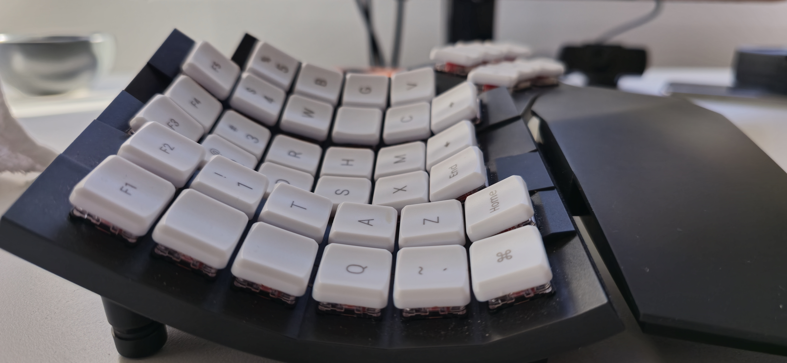
_Notice the down steps for the middle and ring fingers._

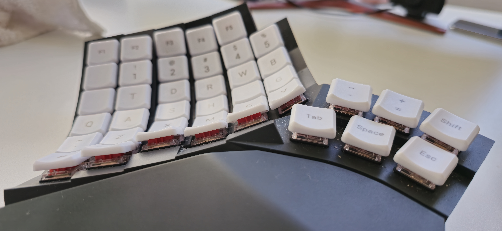
_The perfect thumb cluster design._

I started using the Glove80 with the idea that it had way too many keys (see the "1 key distance from home principal"). I still think it does, but I'm very glad I didn't go with a smaller board for two reasons. Firstly, it's hard to tell what you will be able to reach on a keyboard until you put your hands on it. Rather than "make the number of the keys match what’s comfortably reachable" guesswork, you can simply buy a big board and unmap the keys you can't reach. On the Glove80, I was pleasantly surprised to discover that I could reach the eight keys that are two keys south of the home row. The navigation keys `Home`, `End`, `Page Up`, `Page Down`, and arrows were sorely missed on the base layer of a 34-key board I had previously tried, so this was a big windfall. I also found that I couldn't comfortably hit the pinky column's top key (QWERTY q and p), but I could sub in the key flanking the pink home key (QWERTY caps lock and single quote positions). Secondly, even if you can't comfortably reach everything from the home row, it is nice to have spare keys around for the non-typing functions. Dedicated media keys and keyboard system functions (like switching Bluetooth connections) are examples.

## The layout design process

Before I show you what I landed on, I want to provide a bit more context on custom keyboard layouts and discuss the constraints I put on myself.

Firstly, most discussion around custom layouts is only focused on 30 keys, the 10 columns of 3 including the English letters, comma, period, forward slash, and semicolon. Finding an "optimal" arrangement of all of the keys is an impractically large problem, not to mention highly individual. Many people are satisfied with keeping the standard row-staggered keyboard and just fixing the obvious inefficiency problems with the QWERTY alphas. So, the available tools use 3x10 paradigm. While you can argue that the innermost columns are "one key distance" from the index home key, I find the diagonal reaches are a pain. If you eliminate them, you are left with exactly the 26 keys needed for the English letters. (On row-staggered QWERTY, `T` and `N` are easy to reach, but `Y` and `B` are hard. On ortholinear boards, all 4 are equally bad.)

Secondly, when designing layers, you _could_ take each layer as an additional N keys. The problem is that holding down a layer key with a thumb and reaching elsewhere with the same hand is often uncomfortable. You can avoid this by only mapping keys on the side opposite the thumb responsible for activating the layer. You can still make use of the thumb hand by copying the home row modifiers on unused side (Miryoku system).

The Miryoku layout doesn't have a problem with half-layers, because it uses a full 6 layers, one for each thumb key. On the Glove80, I find it easy to tap all three thumb keys, but uncomfortable to press and hold two of them, so I wanted to get it four layers. I also wanted to limit my layers to the 13 "primary" keys i.e. not cram more into the aforementioned 8 nav keys. At this point things were tight but doable. Two layers were going to be mostly number and function keys, a third was reserved for mouse controls, and the fourth would have to just be the remaining symbol keys.

Miryoku does a cute thing where one layer has numbers and the another layer has the paired symbols on the same positions (`!` for `1`, `@` for `2` and so on). I didn't have space for that, I needed to use layer + `shift` to access some symbols. Turns out that _really sucks_, especially for commonly used symbols like parentheses. It also felt wrong that comma, period, forward slash, and semicolon—previously accessible on the base layer—needed to be chorded in with the `shift` key. Fixing this would require some trickery. My solution is to use yet more tap-holds. All 13 primary keys in my layout have alternate behaviors when they are pressed and held. Putting the common symbols in these base layer hold positions makes them feel more accessible than on another layer, and it frees up just enough space on the symbol layer to be completely free of using `shift` to access symbols. When I say, "just enough," I mean at the end I had just 2 keys left over, which I turned into keys for em- and en-dash.

With that out of the way, we can talk about the alpha configuration. The question of how to arrange the letters is hotly debated by enthusiasts. It largely depends on what you wish to optimize for. For example, if you care about speed, you want to get "rolls" up (on QWERTY, `wet` is an inroll and `few` is an outroll) and single-finger bigrams down (like QWERTY `rt`). In my case, ergonomics was top, so I wanted to minimize "scissors" (bigrams that would cause uncomfortable finger stretches). There's a great tool called [Oxeylyzer](https://github.com/O-X-E-Y/oxeylyzer) that lets you set weight for various factors and generate/optimize layouts for them. Oxeylyzer uses 3x10 paradigm, and how it defines which keys are reachable is based on a row-staggered keyboard, so I had to make some modifications to the scissors definitions, as well some weights for how easy it is to hit each position.

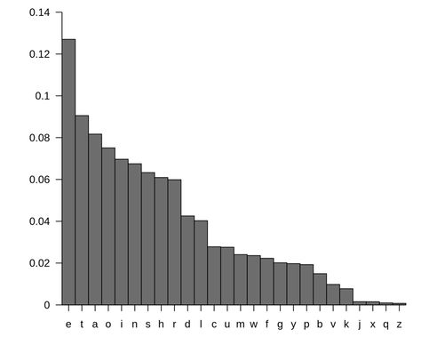

As mentioned earlier, I didn't like hitting the top outer corner keys with my pinkies, but was okay with moving them laterally, and I was cutting the diagonal reaches from the index finger. So for the left hand, rather than a neat 3x5, my columns were 1-2-3-3-3-1. This was going to take a little more elbow grease... I wouldn't want, for example, the outermost key to be considered for an inroll with the top ring finger key. My solution was to exclude the one-key columns from optimization entirely. When you look at a histogram of the English letters, the 4 most infrequent ones (`j`, `q`, `x`, and `z`) are in a tier of their own. The least-used letters should obviously be put on the least-comfortable key positions, so in my case the 4 lateral movement keys were the natural place for them. I let Oxeylyzer optimize the other 22 keys in the main 4 columns first. For the remaining 4 keys, I reasoned that since `x` and `z` are commonly used for the cut and undo shortcuts, they should be put on the outer pinky keys, which I found somewhat easier than the index's lateral moves. I locked the inner 22 keys and let Oxeylyzer decide where to put `x` and `z`, and finally manually placed `j` and `q` in the inner columns (an obvious choice because of `q`'s relationship with `u`).

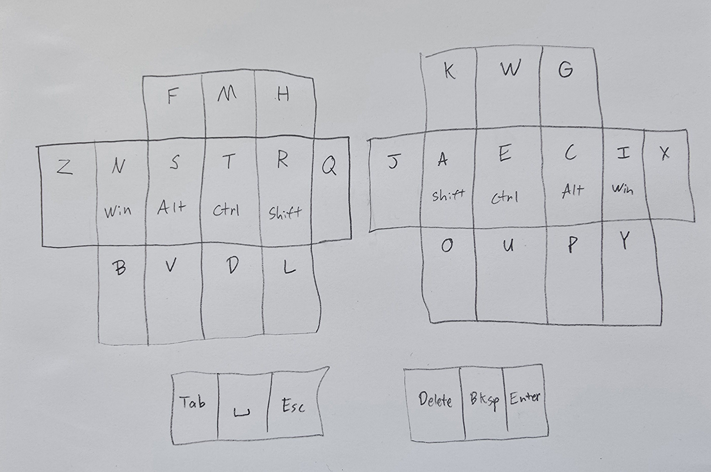

The next thing to figure out was the base layer tap-hold symbols. Like with the home row mods, I was planning on copying these symbols down on other layers, so I loosely divided the common symbols into punctuation and math operators. This way, I could put the latter half on the side opposite the numbers and type math expressions without a lot of layer jumping. This worked beautifully, except that putting single quote on the side with all the consonants was really bad for typing contractions, so it swapped places with the dash/minus sign. If you want to play around with alpha layouts, Oxey also made [this excellent tool](https://oxey.dev/playground/index.html).

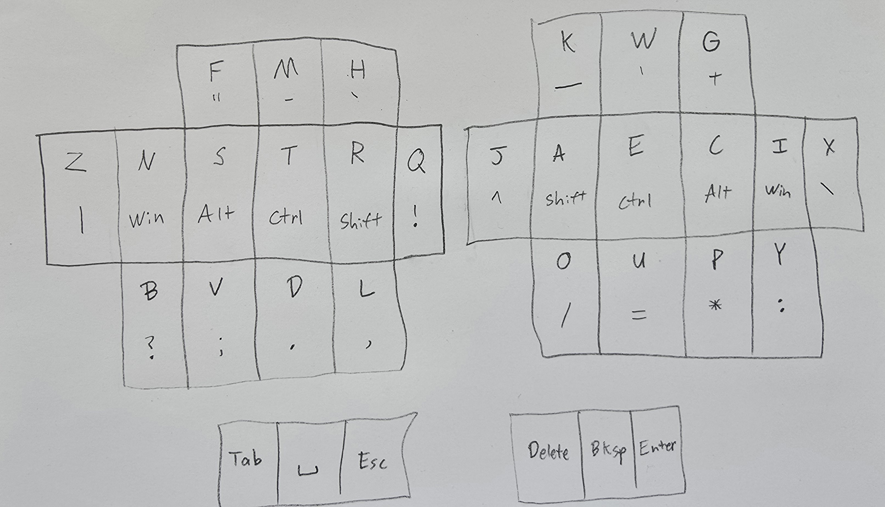

Here's how that looks on the number layer.

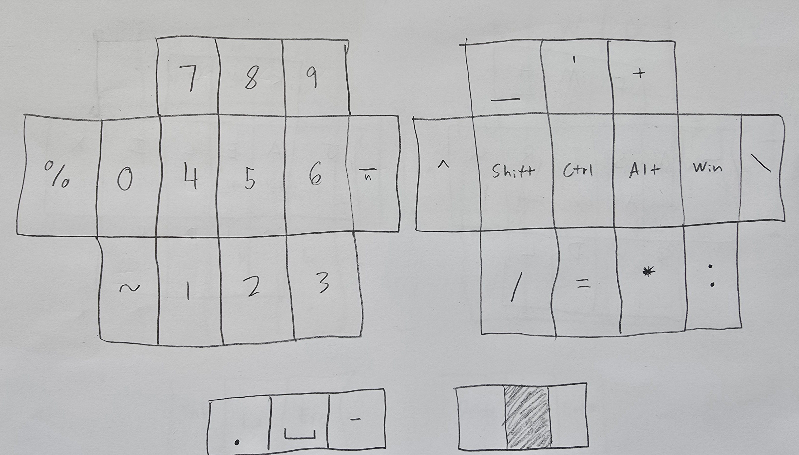

The thumb cluster keys generally retain their tap behaviors from the base layer, but for numbers, I wanted to include `.` again for typing IP addresses. And `-` makes another appearance there since it was removed from the left side. En dash `–` makes sense on the number layer because it is used to denote ranges.

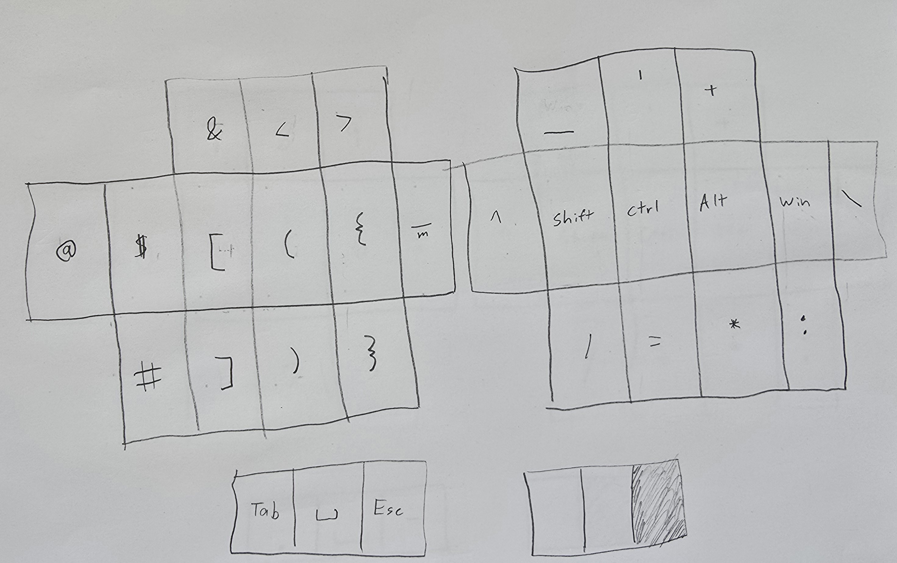

Not too much to say here. I basically laid the symbols out in a way that looked nice rather than try to optimize them. `&` or `#` are other good candidates for the pinky home row, it just depends on what you usually program in. An unexpected win for this layer is the accessibility of `=>`.

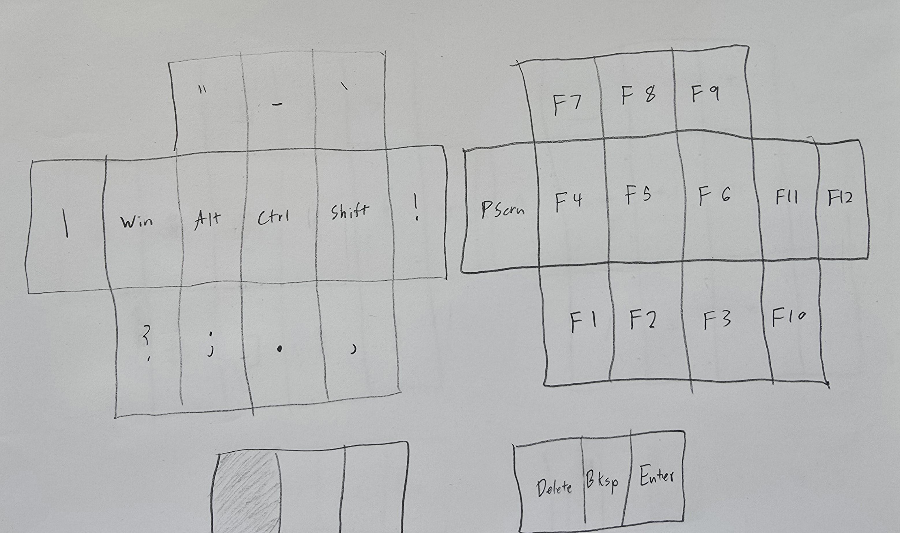

There is no nice way to arrange a series of 12 in this irregular shape. I chose to orient 1–9 like a number pad and just stuff the rest in.

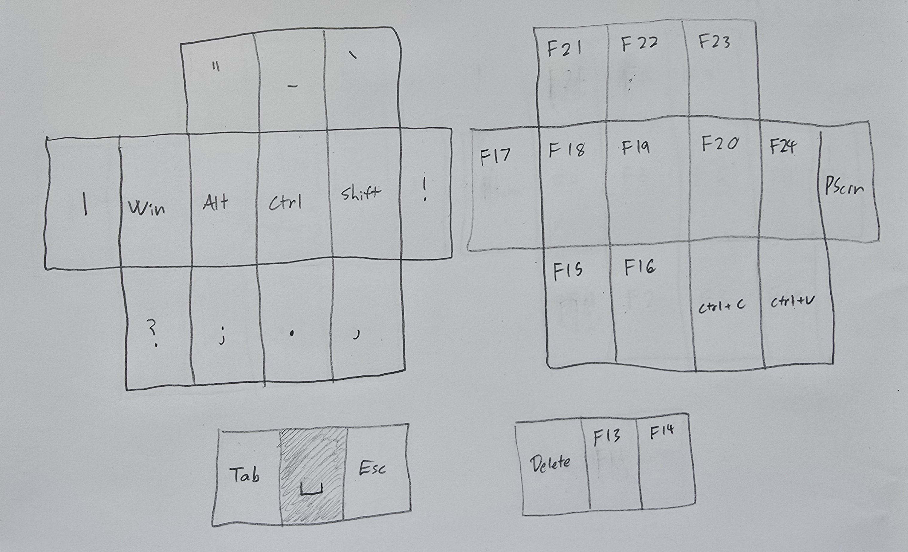

Ah, this isn't very interesting. Let's talk about Talon.

### The mouse scripts

My understanding is that Talon was built as an accessibility tool for people with limited use of their hands. Most people use it to activate scripts with voice commands, but you can also use it to control an eye tracker. (Making your cursor follow your eyes is not the default behavior for a tobii eye tracker. A program needs to manage things like when it's active and how to place the pointer when your eyes are looking in slightly different places.) You can see how this is implemented in Talon [here](https://github.com/croxtonveryepic/talon).

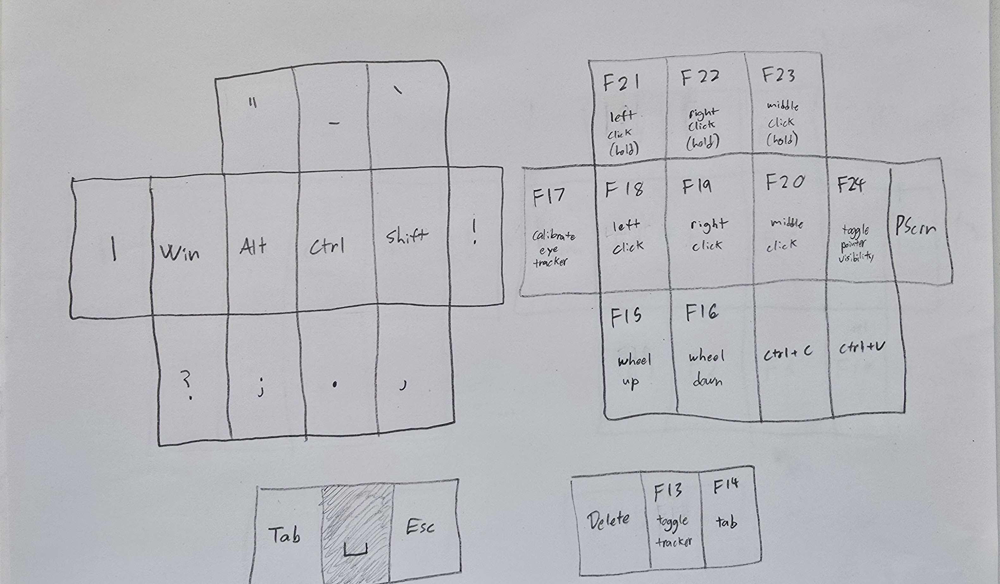
_If you are wondering why the function keys were laid out this way, I have two words for you: legacy design._

My idea with this layout is to emulate actually holding a mouse. The index and middle finger rest on the left and right click buttons, which is the same as a normal palm grip. The middle click button is moved to the ring finger. The eye tracker stays off by default. Pressing the thumb button `F13` activates it, releasing `F13` disables it. Almost like how when you grab a mouse with your thumb pad when you want to move it! I cannot overstate how easy this was to pick up. What makes this even better is a second script that hides the pointer when tracking isn't activated. It's like you don't have a pointer at all, then when you need it, it pops out of nowhere and goes exactly where you need it to. Precisely controlling the eye tracker did take a bit of patience.

Beneath the index and middle finger are keys for sending scroll wheel events. These aren't strictly needed, but they are nice for those UIs that have a lot of different sections to scroll but not a lot of empty space to click on to change focus (looking at you, Jira).

The home row buttons are instant-fire; the upper row sends button down and button up events instead, which lets you do things like click and drag. Technically, you could put these on the home row instead. I like the quick inputs because I'm less likely to misfire by moving my eyes away from the target before the button up triggers. Pressing and holding with eye tracker movement is, expectedly, a bit tricky to use.

The pinky button relates to the pointer-hiding script, which makes the pointer visible on `F13` button down, and hides it on `F13` button up. But sometimes it gets out of sync if you rapidly press `F13`, so `F24` provides a manual toggle as well.

The other thumb button is a vision-based version of `Alt + Tab`, inspired by tobii's software. It open the task switcher while it's pressed, then when you release it, it opens the window you are looking at. I usually keep to just 1–3 windows per virtual desktop, so it isn't that useful for me, but it is much better than pressing tab a dozen times when you have a lot open. I might change this to `Enter` in the future.

By the way, I have three minor frustrations to report with the eye tracker. At least two of them are Windows issues. One, in the Task View (`Win + Tab`), you can't drag windows to other virtual desktops. (You can work around this by opening the context menu (`Shift + F10`) on a window and selecting Move To). Two, certain screens on Windows (notably the login screen and the grant admin permissions prompt) hide the pointer. For some reason moving a physical mouse unhides it, but looking around the eye tracker doesn't. To get around this, I have a normal mouse plugged in on the floor next to my computer that I gently nudge with my toe once a day. Three, if you get logged out from being away for too long, the eye tracker stops working, and you have to restart Talon. That stumped me a bit the first time it happened, but Windows Task Manager has pretty good keyboard navigation. Altogether, it's a very reasonable amount of inconvenience. I expected worse.

### Finishing touches

The final additions to the layout:

- A toggle mouse layer key for pointer-heavy work
- Caps Word (under `Esc`) activates a mode that capitalizes all of your letters until you press space (so you don't need to bounce between `Shift` keys)
- Media keys

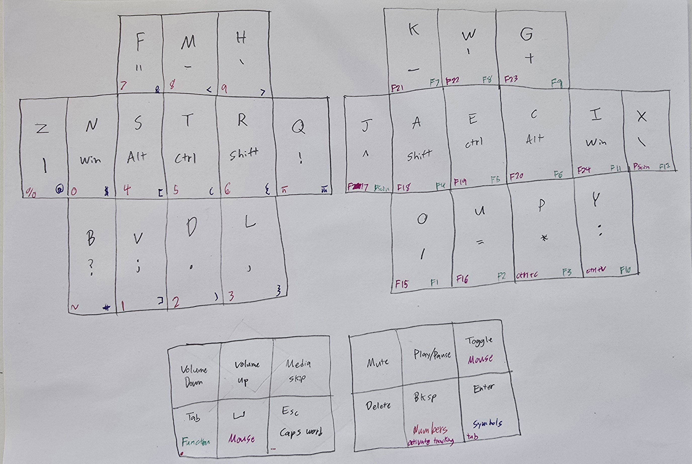

## Retrospective

Everything about this setup works perfectly for my needs. The only thing I might change if I did it again is the alpha layout. The ergonomics are great, but the `k` position is pretty bad. Specifically, there are lot SFBs and SFTs like `okay` and `took`. `jo` is also an awkward bigram—which is rare enough to be okay, except that it's the first two letters of my name!

I had, prior to understanding everything that I wanted out of the keyboard, spent a month learning another alpha layout, Workman. Switching a second time was a huge time investment—the month I spent learning the Workman layout was wasted, and I had to go through the difficulty of unlearning it. (The best time to learn a new alpha layout is when you get a new keyboard—the unfamiliar resting position of your hand helps you think of it as something different and new. I wasted this by mentally imprinting Workman on the Glove80.) I made a promise that I wouldn't do that to myself again, so I'm just going to deal with `k` and `jo` for the forseeable future. Fixing them would be a marginal improvement, and the replacement layout would surely have its own issues. (As I am writing this, I'm questioning if the "obvious" choice of where to put `j` and `q` was actually wrong...)

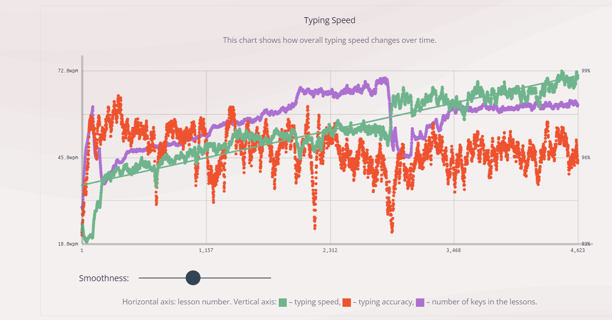
_It took me about a 6 weeks of practice (30 minutes a day) on the [keybr.com](keybr.com) to get up to an above-average typing speed. I much prefer keybr to [monkeytype](monkeytype.com) for how it eases you into learning each letter. (Most "learn to type" websites are QWERTY-specific. The fact that they teach `j` as the first letter would be more hysterical if it weren't so ridiculous.)_

### VS Code btw

It's hip to use Vim nowadays. **I think vim is a great way to cope with QWERTY.** The arrow positions are really bad on a standard keyboard, as are the modifier keys, and vim fixes these issues by being modal. But I've already fixed these problems by fixing the keyboard! Home row mods give you enough flexibility with your keyboard shortcuts to not need modes. Yes, I had to re-write every VS Code shortcut because the defaults are terrible, but I'd have to do the same with _any_ editor because I'm using a totally bespoke alpha layout. I like VS Code's shortcut manager and `when` clause system, and the extension ecosystem is very good. Vim does some other cool stuff too, of course, I'm not counting out learning it someday. But when people talk about why they like using Vim, I hear all of the same reasons I did all of this: to reduce input friction. And unlike Vim, this stuff applies to every program and website.

### Bluetooth Safety

For the .1% of readers that have concerns about putting your hands on a radio frequency-emitting device for 8+ hours per day—the Glove80 uses Bluetooth to connect the two halves even if you plug it in—I would first suggest you check your cell phone usage, and then I'd inform you that Bluetooth Low Energy is very safe. (BLE is a commonly used for short-range devices purely because it increases battery life.) I would know it's safe because I was curious enough to obtain a TriField meter and walk around my house testing things. The amount of radio frequency (RF) radiation coming off BLE devices is orders of magnitudes less than phones, routers, and other WiFi devices like laptops and Amazon Alexa. If you're using a desktop, a wired keyboard may actually emit _more_ RF radiation due to the noisy nature of switched-mode power supplies. And, naturally, wired devices will weak have AC electric fields as well. I think air gapped BLE devices are the clear best choice from a risk reduction perspective.

## Conclusion

I hope you enjoyed reading about my completely bespoke layout. The following is the MoErgo default README information. If you want to try my layout on your Glove80, the instructions for that are below.

## MoErgo Glove80 Custom Configuration for ZMK

This repo is the official ZMK configuration of the MoErgo Glove80 wireless split contoured keyboard. Use it to develop your own keymap and easily build your own ZMK firmware to run on your Glove80.

**NOTE: You can also customize the layout of your Glove80 keyboard with the Glove80 Layout Editor webapp. For most users Glove80 Layout Editor is the recommended and simpler option. More information is available at the official MoErgo Glove80 Support site (see resources below).**

These steps will get you using your keymap on your keyboard in the fastest time possible. It uses the GitHub Actions feature to build your firmware online.

If you are looking to dig deeper into ZMK and develop new functionality, it is recommended to follow the steps of installing ZMK as found on the official ZMK documentation site (linked below).

## Resources

- The [official MoErgo Glove80 Support](https://moergo.com/glove80-support) web site. Glove80 documentation and other technical resources.
- The [official MoErgo Discord Server](https://moergo.com/discord). Instant conversations with other Glove80 users.

- The [official ZMK Documentation](https://zmk.dev/docs) web site. Find the answers to many of your questions about ZMK Firmware.
- The [official ZMK Discord Server](https://discord.gg/8cfMkQksSB). Instant conversations with other ZMK developers and users. Great technical resource!

- The [official Glove80 ZMK Distribution](https://github.com/moergo-sc/zmk). Repository for ZMK firmware customized for Glove80.

## Instructions

1. Log into, or sign up for, your personal GitHub account.
2. Create your own repository using this repository as a template ([instructions](https://docs.github.com/en/repositories/creating-and-managing-repositories/creating-a-repository-from-a-template)) and check it out on your local computer.
3. Edit the keymap file(s) to suit your needs
4. Commit and push your changes to your personal repo. Upon pushing it, GitHub Actions will start building a new version of your firmware with the updated keymap.

## Firmware Files

To locate your firmware files and reflash your Glove80...

1. log into GitHub and navigate to your personal config repository you just uploaded your keymap changes to.
2. Click "Actions" in the main navigation, and in the left navigation click the "Build" link.
3. Select the desired workflow run in the centre area of the page (based on date and time of the build you wish to use). You can also start a new build from this page by clicking the "Run workflow" button.
4. After clicking the desired workflow run, you should be presented with a section at the bottom of the page called "Artifacts". This section contains the results of your build, in a file called "glove80.uf2"
5. Download the glove80.uf2
6. Flash the firmware to Glove80 according to the user documentation on the official Glove80 Glove80 Support website (linked above)

Your keyboard is now ready to use.
